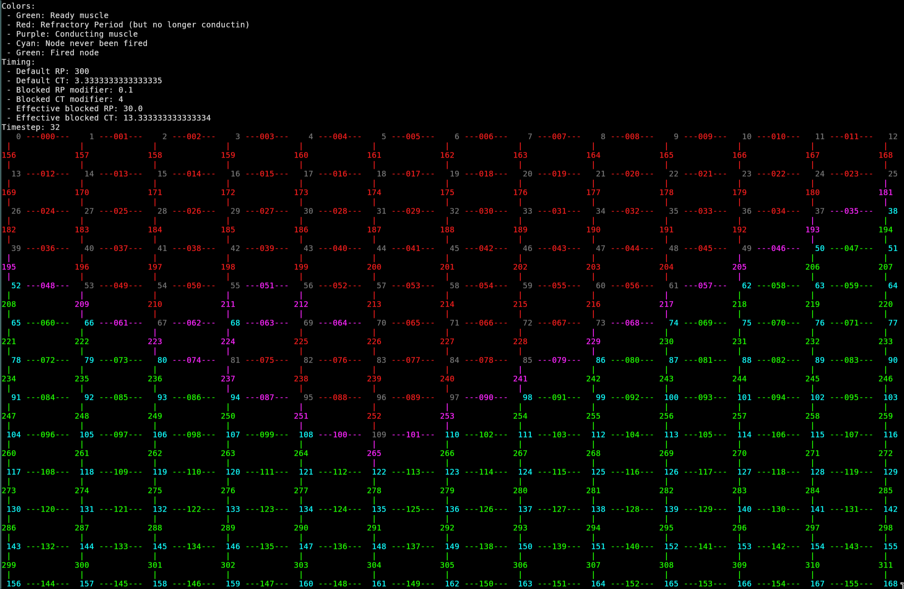
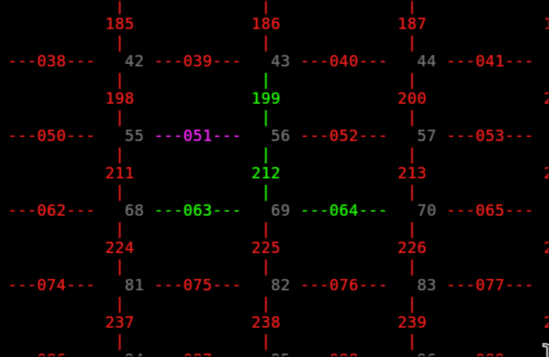
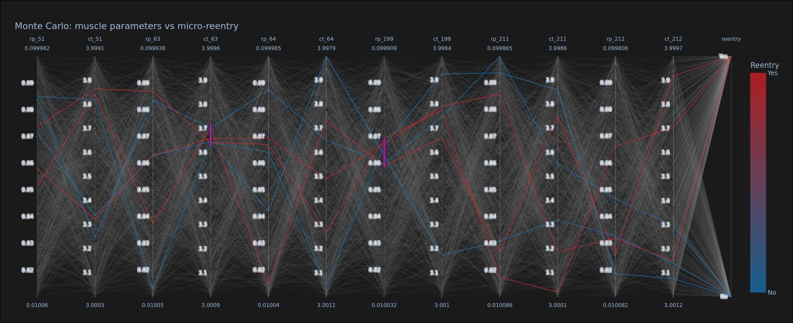
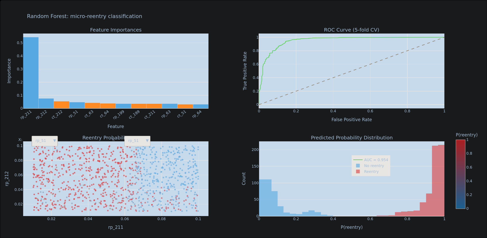
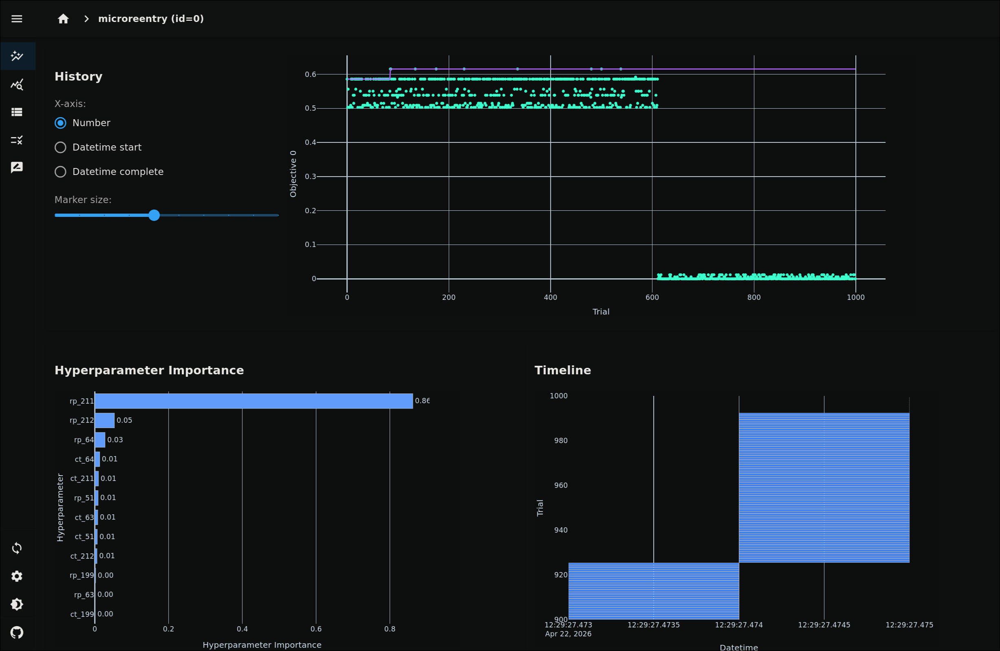
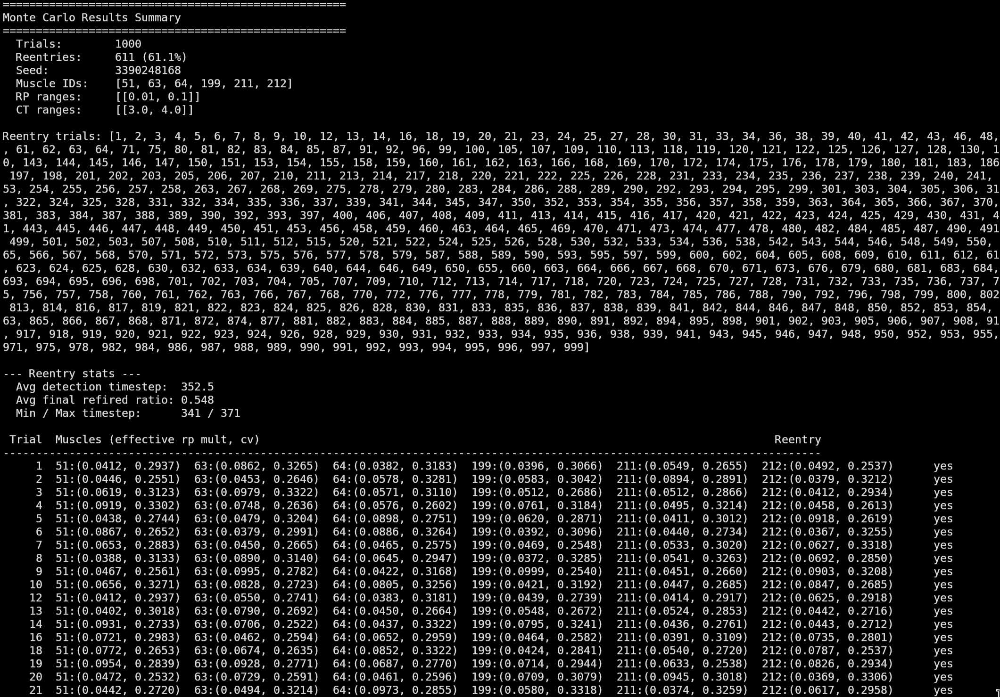

# Micro-Reentry Cardiac Simulation

A computational model of **micro-reentry**, a type of cardiac arrhythmia where an electrical signal gets trapped in a small loop in heart tissue and keeps cycling, rather than dying out normally. This project simulates that behavior on a grid of cardiac cells and uses **Monte Carlo** experiments to discover which tissue parameters make reentry more or less likely.

**Author:** Phil Alcorn — Tarleton State University

---

## Table of Contents

1. [Background: What is Micro-Reentry?](#1-background-what-is-micro-reentry)
2. [How the Model Works](#2-how-the-model-works)
3. [Setup: Installing Python and Dependencies](#3-setup-installing-python-and-dependencies)
4. [Viewing the Grid Layout](#4-viewing-the-grid-layout)
5. [Running the Monte Carlo Simulation](#5-running-the-monte-carlo-simulation)
6. [Replaying a Specific Trial](#6-replaying-a-specific-trial)
7. [Visualizing Results](#7-visualizing-results)
8. [Printing a Text Summary of Results](#8-printing-a-text-summary-of-results)
9. [Understanding the Output and Results File](#9-understanding-the-output-and-results-file)
10. [In-Source Configuration](#10-in-source-configuration)
11. [Script Argument Reference](#11-script-argument-reference)
12. [File Overview](#12-file-overview)

---

## 1. Background: What is Micro-Reentry?

In a healthy heart, an electrical signal originates at the sinoatrial (SA) node and spreads outward through cardiac muscle tissue. Each muscle fiber:
1. **Activates** (or, fires) when the electrical wave reaches it. In this model, this activation happens at the nodes between muscles.
2. **Conducts** the signal forward to neighboring tissue. In this model, this conduction process takes a time period CT, or conduction time.
3. Enters a **refractory period** — a short window where it cannot fire again, no matter how much it is stimulated. Dictated by RP in this model.

The refractory period is critical: it prevents the signal from refiring the same muscle. Once the wave has passed, the tissue it came from is still refractory, so the signal can only travel *forward*. This is a fully enforced requirement of this simulation.

**Micro-reentry** occurs when the refractory period of a small region is abnormally short. If tissue recovers before the surrounding wavefront has moved far enough away, the signal can loop back and re-excite the same tissue. The result is a self-sustaining loop of electrical activity. This is a direct cause of arrhythmias.

This simulation models this process on a non dimensional grid, and enables the use of statistical experiments to determine the range of tissue parameters (specifically, refractory period length and conduction speed) that leads to reentry for a given network setup. Non-dimenionality is preferred as any arrangement of muscles can be studied without regard to the physical position, so long as conduction time and refractory period are known.

---

## 2. How the Model Works

### The Grid

The cardiac tissue is represented as a network of nodes and muscles:

- A **node** represents a junction point in the tissue. It is essentiall a location where multiple fibers meet.
- A **muscle**, or **edge**  connects exactly two adjacent nodes and carries the electrical signal between them. Note that a node can have multiple edges connected.

The default construction is a network that can be visualized as a 2D grid:
For a grid of side length `L`, there are:
- **(L+1) × (L+1) nodes**, numbered left-to-right, top-to-bottom starting at 0.
- **2 × L × (L+1) muscles**: horizontal muscles first (numbered row by row), then vertical muscles.

The default grid has `L = 12`, giving **169 nodes** and **312 muscles**.

```
Node 0 ---muscle 0--- Node 1 ---muscle 1--- Node 2 ........
  |                     |                     |
muscle 156           muscle 157            muscle 158 ..... 
  |                     |                     |
Node 13 --muscle 12-- Node 14 --muscle 13-- Node 15 .......
  ...                   ...                  ...
  ...                   ...                  ...
  ...                   ...                  ...
  ...
```

### Nodes

Nodes are passive. They receive a signal and immediately attempt to fire all connected muscles. Muscles that are currently in their refractory period are not able to be fired. Ideally, there would be some sort of signal strength / intensity threshold, but that is not included in this model. 

### Muscles

A muscle has two key timing parameters:

| Parameter            | Symbol | Default  | Meaning |
|----------------------|--------|----------|---------|
| **Conduction Time** | CT | ~3.33 ms | How long the electrical signal takes to travel through the muscle. The signal arrives at the far node only after this many timesteps. |
| **Refractory Period** | RP | 300 ms | How long the muscle stays inactive after firing. It cannot be re-activated until this period expires. |

The physiological constraint, mentioned earlier, is that **RP must be greater than CT**. If a muscle's refractory period were shorter than its conduction time, it would reset before the signal even finished passing through, which is physically impossible, and would cause a microreentry by continuously refiring itself.

### Simulation Steps

Each timestep, which represents 1ms, the simulation:
1. Advances every active muscle's internal timer by 1 (ms).
2. When a muscle's timer reaches its conduction time, it fires the opposite node.
3. Each newly fired node in turn activates all the other connected muscles that are not refractory.
4. When a muscle's timer reaches its refractory period, it resets to idle and becomes ready to fire again.

The simulation starts by firing **node 5** by default, and then fires it again every `heartbeat_time` timesteps to represent the regular heartbeat. Note that during monte carlo simulations, the test for reentry is cut off before the beat node has a chance to refire. This will be discussed in further detail later.

### Micro-Reentry Detection

Reentry is detected when more than **50% of all nodes** have fired more than once before the next heartbeat. (Less than 50% resulted in microreentries being detected that ended up fizzling out, and not causing an actual reentry.)

### Monte Carlo Experiments

Rather than testing a single configuration, the simulation is cable of running any number of independent trials. In each trial, a user-defined set of muscles has their refractory period and conduction time randomized within a specified range, and the simulation runs to see whether reentry occurs. After all trials, the results show the statistical relationship between tissue parameters and reentry probability.

---

## 3. Setup: Installing Python and Dependencies

### Prerequisites

Python 3.10 or newer is required. To check your version, open a terminal and type:

```bash
python3 --version
```

If Python is not installed, download it from [python.org](https://www.python.org/downloads/).

### Installing Required Packages

The core simulation scripts only use Python's standard library and need no additional installation. However, the **visualization script** (`results/visualize.py`) requires two extra packages.

Install them by running:

```bash
pip install pandas plotly
```


### Testing environment setup

From the project folder, run:

```bash
python3 src/view_mesh.py
```

If you see a colored grid of numbers printed in your terminal, the setup is working correctly. You may need to zoom out the terminal to view the grid properly.

---

## 4. Viewing the Grid Layout

Before running simulations, it helps to see the grid and understand which muscle and node IDs are where.

```bash
python3 src/view_mesh.py
```

This prints the full 12×12 grid with every node ID and muscle ID labeled in place. Nodes appear as numbers at grid intersections; horizontal muscles appear as `---ID---` labels between nodes; vertical muscles appear as `|` bars with their ID below.

**Options:**

| Option | Example | Effect |
|--------------|--------------|--------|
| `--length N` | `--length 5` | Change the grid size (default: 12). Use a smaller number like 5 or 6 to see a grid that fits on one screen. |
| `--plain`    | `--plain`    | Remove color codes — useful if copying the output to a document. |

**Example — small 5×5 grid, no color:**
```bash
python3 src/view_mesh.py --length 5 --plain
```

Use this view to identify the IDs of the muscles you want to target in the Monte Carlo experiments.


---

## 5. Running the Monte Carlo Simulation

The main simulation is run via `src/script.py`. The easiest way is through the provided shell script:

```bash
./scripts/run.sh
```

This runs 1,000 trials with graphics and display turned off (for speed), and saves results to `results/monte_carlo_micro_hits.json`.

### With a Fixed Seed (Reproducible Results)

If you want the exact same random trials every time — useful for reproducing a specific result for a paper or presentation — pass an integer seed:

```bash
./scripts/run.sh 42
```

Any integer will work as the seed. The same seed always produces the same sequence of random trials.

### Running Directly with Python

You can also run `src/script.py` directly and pass options:

```bash
python3 src/script.py
```

**Common options:**

| Option                   | Default | Example                  | Effect |
|--------------------------|---------|--------------------------|--------|
| `--graphics true`        | `false` | `--graphics true`        | Show the animated grid in the terminal while simulating. Slows down the run significantly. |
| `--sim_time 0.05`        | `0`     | `--sim_time 0.05`        | Seconds to pause between timesteps when graphics are on. |
| `--length 12`            | `12`    | `--length 8`             | Grid size. |
| `--heartbeat_time 1000`  | `1000`  | `--heartbeat_time 500`   | Timesteps between simulated heartbeats. |
| `--firing_node 5`        | `5`     | `--firing_node 0`        | Which node starts the initial signal. |


### What You Will See

The script prints progress every 1,000 trials:
```
Monte Carlo seed: 2847392918
Monte Carlo progress: 1000/1000
```
And finishes with a results summary:
```
Monte Carlo summary:
 - Target muscle ids: [51, 63, 64, 199, 211, 212]
 - RP ranges: [(0.01, 0.1)]
 - CT ranges: [(3.0, 4.0)]
 - Trials: 1000
 - Reentries: 600
 - Reentry rate: 0.600
 - Saved results: results/monte_carlo_micro_hits.json
```

(The results are automatically saved to `results/monte_carlo_micro_hits.json`, but this can be changed with a command line option)

---

## 6. Replaying a Specific Trial

After running the Monte Carlo simulation, you can replay any individual trial from the saved results, including watching it animate in the terminal.

The easiest way is the interactive shell script:

```bash
./scripts/replay.sh
```

This will:
1. Load the saved results and show you which trials produced reentry.
2. Ask you to type a trial number. (Non- reentry runs can also be selected)
3. Run that trial with a live animated display.

The resulting grid will look something like this, where green is muscle ready to fire, purple is muscle that just fired and still has a signal propogating, and red is muscle in refractory period. 


**Example session:**
```
Available trials: 1000 (valid range: 1-1000)
Reentry trials: 7 45 83 101 ...
Enter trial number: 45
```

You can also control the animation speed by passing a delay in seconds:

```bash
./scripts/replay.sh 0.05    # 50ms between each timestep (default)
./scripts/replay.sh 0.2     # 200ms — slower and easier to watch
./scripts/replay.sh 0.01    # 10ms — very fast
```

### Replaying Directly with Python

For more control, use `src/replay_monte_carlo_trial.py` directly:

```bash
python3 src/replay_monte_carlo_trial.py \
    --results_path results/monte_carlo_micro_hits.json \
    --trial 45 \
    --graphics true \
    --infinite true \
    --sim_time 0.05
```

**Key options:**

| Option                   | Example                                              | Effect |
|--------------------------|------------------------------------------------------|--------|
| `--results_path PATH`    | `--results_path results/monte_carlo_micro_hits.json` | Path to the saved results file (required). |
| `--trial N`              | `--trial 45`                                         | Replay trial number N. |
| `--hit_index N`          | `--hit_index 0`                                      | Replay the Nth reentry hit (0 = first reentry found). |
| `--infinite true`        | `--infinite true`                                    | Keep running the simulation after reentry is detected (so you can watch it loop). |
| `--graphics true/false`  | `--graphics true`                                    | Show the animated grid. |
| `--sim_time 0.05`        | `--sim_time 0.1`                                     | Seconds between timesteps in the display. |
| `--max_timesteps N`      | `--max_timesteps 200`                                | Stop after N timesteps even if reentry has not been detected. |

**Example — replay the first reentry hit, no animation, just the final result:**
```bash
python3 src/replay_monte_carlo_trial.py \
    --results_path results/monte_carlo_micro_hits.json \
    --hit_index 0 \
    --graphics false


```
Here is an example Reentry:


---

## 7. Visualizing Results

Once you have a results file, you can generate an interactive parallel coordinates plot that opens automatically in your web browser. Note: In my personal experience,the random forest visualizer is the most insightful. I have not removed the other options in case they are of some benefit in the future. 

```bash
python3 results/visualize.py
```

Or, specifying a different results file or output location:

```bash
python3 results/visualize.py results/monte_carlo_micro_hits.json --out results/my_plot.html
```

### What the Plot Shows

The plot displays one line per trial. Each vertical axis represents a parameter that was randomized:
- **`rp_N`** — the refractory period multiplier used for muscle N.
- **`ct_N`** — the conduction time multiplier used for muscle N.
- **`reentry`** — whether that trial produced reentry (Yes/No axis on the right).

Lines are colored **blue** for trials with no reentry and **red** for trials where reentry occurred.

**How to use the plot interactively:**
- Click and drag on any vertical axis to select a range. Lines outside that range are hidden, letting you filter to specific parameter combinations.
- Select a range on the `reentry` axis to isolate just the reentry or non-reentry trials.
- Drag a selection on the `rp_N` axis to see which refractory period values correspond to reentry.

This allows you to visually identify the threshold: e.g., "reentry only occurs when the RP multiplier for muscle 211 is below 0.04."



### Other Visualization Scripts

Two additional scripts in the `results/` folder offer alternative views of the same data.

**Random Forest analysis (`results/rf_visualize.py`)**

Trains a Random Forest classifier on the trial results and opens a 4-panel interactive plot in your browser:

- **Feature Importances** — which muscles' RP or CT values had the most influence on whether reentry occurred.
- **ROC Curve** — model accuracy measured by 5-fold cross-validation (AUC closer to 1.0 means the parameters reliably predict reentry).
- **Reentry Probability Scatter** — a scatter of the two most important features, colored by predicted reentry probability.
- **Predicted Probability Distribution** — histogram comparing the model's confidence scores for reentry vs. non-reentry trials.

```bash
python3 results/rf_visualize.py
```

Requires `scikit-learn` in addition to `pandas` and `plotly` (`pip install scikit-learn`). Accepts the same optional arguments as `visualize.py`:

```bash
python3 results/rf_visualize.py results/monte_carlo_micro_hits.json --out results/results_rf.html
```



**Optuna dashboard (`results/view_optuna.py`)**

Loads the trial results into an [Optuna](https://optuna.org) study and launches the Optuna web dashboard, a richer interactive UI for exploring parameter relationships:

```bash
python3 results/view_optuna.py
```

Then open `http://localhost:8080` in your browser. Press `Ctrl+C` to stop the server.

Requires `optuna` and `optuna-dashboard` (`pip install optuna optuna-dashboard`). You can change the port if 8080 is already in use:

```bash
python3 results/view_optuna.py --port 8081
```



*Note that the random forest trainer and the optuna dashboard are not reccomended for larger monte carlo sets.*

---

## 8. Printing a Text Summary of Results

For a plain-text summary without opening a browser: 

```bash
python3 results/print_results.py
```

This reads `results/monte_carlo_micro_hits.json` and prints:

```
====================================================
Monte Carlo Results Summary
====================================================
  Trials:        1000
  Reentries:     600 (60.0%)
  Seed:          2847392918
  Muscle IDs:    [51, 63, 64, 199, 211, 212]
  RP ranges:     [[0.01, 0.1]]
  CT ranges:     [[3.0, 4.0]]

Reentry trials: [7, 45, 83, ...]

--- Reentry stats ---
  Avg detection timestep:  87.3
  Avg final refired ratio: 0.721
  Min / Max timestep:      42 / 499

 Trial  Muscles (effective rp mult, ct mult)           Reentry
------  -------------------------------------------    -------
     7  51:(0.0231, ...)  63:(...)  ...                    yes
    45  ...                                                yes
```

Each row shows the effective parameter multipliers used for that trial, and whether reentry was detected. This script is particularly useful to tranfer parameters to other simulations or models.



---

## 9. Understanding the Output and Results File

The results are saved as a JSON file at `results/monte_carlo_micro_hits.json`. JSON is a plain text format that can be opened in any text editor. The structure is:

```json
{
  "trials": 1000,
  "reentry_count": 600,
  "reentry_rate": 0.6,
  "muscle_ids": [51, 63, 64, 199, 211, 212],
  "rp_ranges_input": [[0.01, 0.1]],
  "ct_ranges_input": [[3.0, 4.0]],
  "seed": 2847392918,
  "trial_results": [
    {
      "trial": 7,
      "micro": true,
      "micro_node_id": 83,
      "timestep": 156,
      "detection_timestep": 87,
      "final_refired_ratio": 0.74,
      "modifications": [
        {
          "muscle_id": 51,
          "randomized_rp": 0.023,
          "randomized_ct": 3.4,
          "effective_rp": 7.0,
          "effective_ct": 11.3
        },
        ...
      ]
    },
    ...
  ]
}
```

**Key fields explained:**

| Field                   | Meaning |
|-------------------------|---------|
| `trials` | Total number of independent simulations run. |
| `reentry_count` | Number of trials where micro-reentry was detected. |
| `reentry_rate` | Fraction of trials with reentry (0.0 to 1.0). |
| `muscle_ids` | The muscle IDs whose parameters were randomized. |
| `seed` | The random seed used — record this to reproduce the exact same results. |
| `trial` | Trial number (1-indexed). |
| `micro` | `true` if reentry was detected in this trial. |
| `micro_node_id` | The node ID where reentry was first detected. |
| `detection_timestep` | The timestep at which reentry was first flagged. |
| `final_refired_ratio` | Fraction of nodes that fired more than once by simulation end. A higher number means more widespread reentry. |
| `randomized_rp` | The multiplier that was randomly drawn for that muscle's refractory period. |
| `effective_rp` | The actual refractory period (in timesteps) used: `randomized_rp × default_rp`. |
| `effective_ct` | The actual conduction time (in timesteps) used. |

---

## 10. In-Source Configuration

Some parameters cannot be changed via command-line flags and must be set by editing the source files directly.

### `script.py` — Monte Carlo Setup

These variables are defined at the top of the `main()` function in `script.py`:

| Variable               | Default                                  | Description |
|------------------------|------------------------------------------|-------------|
| `mc_trials`            | `1000`                                   | Number of independent trials to run. More trials give more statistically reliable results but take longer to complete. |
| `mc_target_muscle_ids` | `[51, 63, 64, 199, 211, 212]`            | IDs of the muscles whose RP and CT are randomized each trial. All other muscles keep their default values. Use `view_mesh.py` to identify muscle IDs. |
| `mc_rp_ranges`         | `[(0.01, 0.1)]`                          | RP multiplier range(s) sampled uniformly each trial. A single entry applies to all target muscles; provide one entry per muscle to assign individual ranges. |
| `mc_ct_ranges`         | `[(3.0, 4.0)]`                           | CT multiplier range(s). Follows the same single-or-per-muscle broadcasting rule as `mc_rp_ranges`. |
| `mc_max_timesteps`     | `500`                                    | Timestep cap per trial. Trials that have not produced reentry by this point are recorded as non-reentry. |
| `mc_save_path`         | `"results/monte_carlo_micro_hits.json"`  | File path where results are written after the run. |

**Trials:** 100 trials runs in seconds; 10,000 trials takes a few minutes.

**Target muscles:** Use `python3 src/view_mesh.py` to see the grid and identify muscle IDs. Muscles near the center of the grid are typically more interesting for reentry studies.

**Ranges:** The range values are multipliers of each muscle's default RP or CT. A single range in the list applies to all target muscles. To assign individual ranges, provide one entry per muscle — the list length must match `mc_target_muscle_ids`:

```python
mc_target_muscle_ids = [51, 211]
mc_rp_ranges = [
    (0.01, 0.05),   # muscle 51: very short RP
    (0.05, 0.15),   # muscle 211: moderately short RP
]
mc_ct_ranges = [
    (3.0, 4.0),     # single range — applies to both muscles
]
```

### `config.py` — Global Tissue Defaults

These values define the baseline tissue properties for all muscles before any per-trial randomization is applied:

| Variable     | Default        | Description |
|--------------|----------------|-------------|
| `default_ct` | `10/3` (~3.33) | Default conduction time for all muscles, in timesteps (ms). |
| `default_rp` | `300`          | Default refractory period for all muscles, in timesteps (ms). Must be greater than `default_ct`. |

```python
default_ct: float = 10/3     # conduction time in timesteps
default_rp: float = 300      # refractory period in timesteps
```

---

## 11. Script Argument Reference

### `src/script.py`

Runs the Monte Carlo simulation over many randomized trials and saves the results to a JSON file. The Monte Carlo setup (target muscles, trial count, parameter ranges) is configured in the source file — see [Section 10](#10-in-source-configuration).

| Flag                      | Default | Description |
|---------------------------|---------|-------------|
| `--length N`              | `12`    | Grid side length. Produces (N+1)² nodes and 2×N×(N+1) muscles. |
| `--heartbeat_time N`      | `1000`  | Timesteps between simulated heartbeats. |
| `--firing_node N`         | `5`     | Node ID that receives the initial electrical signal. |
| `--perf_check true/false` | `true`  | Print elapsed wall-clock time at the end of the run. |

---

### `src/replay_monte_carlo_trial.py`

Loads a saved Monte Carlo results file and replays a single trial, with optional live animation in the terminal.

| Flag                      | Default         | Description |
|---------------------------|-----------------|-------------|
| `--results_path PATH`     | *(required)*    | Path to the saved JSON results file. |
| `--trial N`               | —               | Replay trial number N (1-indexed, as stored in the results file). |
| `--hit_index N`           | `0`             | Replay the Nth record in the results (0 = first). Ignored when `--trial` is provided. |
| `--source`                | `trial_results` | Which section of the JSON to read from: `trial_results` or `hits`. |
| `--max_timesteps N`       | —               | Stop replay after N timesteps even if reentry has not been detected. |
| `--infinite true/false`   | `false`         | Keep simulating after reentry is detected. Useful for watching the self-sustaining loop continue. |
| `--graphics true/false`   | `true`          | Show the animated grid in the terminal. |
| `--sim_time F`            | `0.05`          | Seconds to pause between timesteps when graphics are on. |
| `--log true/false`        | `false`         | Print a running event log below the animated grid. |
| `--debugging true/false`  | `false`         | Print full internal state for every muscle at every timestep. Very verbose. |
| `--perf_check true/false` | `true`          | Print elapsed wall-clock time at the end. |
| `--heartbeat_time N`      | `1000`          | Timesteps between simulated heartbeats. |
| `--length N`              | `12`            | Grid side length. Must match the grid used when the results were generated. |
| `--firing_node N`         | `5`             | Node ID that starts the initial electrical signal. |
| `--max_log_lines N`       | `25`            | Maximum number of lines shown in the event log panel. |

---

### `src/view_mesh.py`

Prints a labeled static diagram of the node/muscle grid to the terminal. Use this to identify muscle and node IDs before configuring a Monte Carlo experiment.

| Flag         | Default | Description |
|--------------|---------|-------------|
| `--length N` | `12`    | Grid side length to display. Use a small number (5–6) to fit comfortably on one screen. |
| `--plain`    | off     | Strip ANSI color codes from the output, useful for copying into a document. |

---

### `results/visualize.py`

Generates an interactive parallel coordinates plot and opens it in the browser. Each line represents one trial, colored red (reentry) or blue (no reentry). Click and drag on any axis to filter by parameter range.

| Argument             | Default                               | Description |
|----------------------|---------------------------------------|-------------|
| *(positional path)*  | `results/monte_carlo_micro_hits.json` | Path to the results JSON file. |
| `--out PATH`         | `results/results.html`                | Output path for the generated HTML file. |

---

### `results/rf_visualize.py`

Trains a Random Forest classifier on the trial results and opens a 4-panel interactive plot: feature importances, ROC curve, reentry probability scatter, and predicted probability distribution. Requires `scikit-learn`.

| Argument             | Default                               | Description |
|----------------------|---------------------------------------|-------------|
| *(positional path)*  | `results/monte_carlo_micro_hits.json` | Path to the results JSON file. |
| `--out PATH`         | `results/results_rf.html`             | Output path for the generated HTML file. |

---

### `results/view_optuna.py`

Loads trial results into an Optuna study and launches the Optuna web dashboard at `http://localhost:<port>`. Press `Ctrl+C` to stop the server. Requires `optuna` and `optuna-dashboard`.

| Argument             | Default                               | Description |
|----------------------|---------------------------------------|-------------|
| *(positional path)*  | `results/monte_carlo_micro_hits.json` | Path to the results JSON file. |
| `--port N`           | `8080`                                | Port to run the dashboard server on. |
| `--study-name NAME`  | `microreentry`                        | Name assigned to the Optuna study. |

---

### `results/print_results.py`

Prints a plain-text summary of the Monte Carlo results to the terminal. Takes no arguments; reads from `results/monte_carlo_micro_hits.json`.

---

## 12. File Overview

```
microreentry/
├── README.md
├── src/
│   ├── script.py                    Main entry point — configures and runs Monte Carlo experiments.
│   ├── replay_monte_carlo_trial.py  Replay one trial from saved results, with optional animation.
│   ├── view_mesh.py                 Print the grid with all node/muscle IDs labeled.
│   ├── config.py                    Defines all simulation parameters and parses CLI flags.
│   ├── simulation.py                Core simulation loop (timestep updates, reentry detection).
│   ├── monte_carlo.py               Monte Carlo runner — randomizes parameters over many trials.
│   ├── topology.py                  Builds the node/muscle grid from a given side length.
│   ├── nodes.py                     Node class — receives signals and triggers connected muscles.
│   ├── muscles.py                   Muscle class — conducts signals and enforces refractory period.
│   ├── display.py                   Terminal display — renders the animated grid during replay.
│   └── drawing.py                   Low-level ANSI terminal drawing functions and color codes.
├── scripts/
│   ├── run.sh                       Run the Monte Carlo simulation (wraps src/script.py).
│   └── replay.sh                    Interactive prompt to replay a saved trial.
├── results/
│   ├── monte_carlo_micro_hits.json  Saved Monte Carlo results (created by scripts/run.sh).
│   ├── results.html                 Interactive visualization (created by visualize.py).
│   ├── visualize.py                 Generates the interactive parallel coordinates plot.
│   ├── rf_visualize.py              Alternate visualization (random forest feature importance).
│   ├── view_optuna.py               Launches the Optuna dashboard for exploring results.
│   └── print_results.py             Prints a plain-text summary of results to the terminal.
├── tests/
│   ├── conftest.py                  Adds src/ to sys.path for test imports.
│   └── test_simulation.py           Unit tests for core simulation logic.
└── presentation/                    Slides, figures, and video from the research presentation.
```

---

## Acknowledgments

This project was completed for the High Performance Computing Lab at Tarleton State University. Many thanks to Dr. Bryant Wyatt and Dr. Madhur Wyatt for their support and direction while working on this project. 

---

## Quick-Start Checklist

For someone running this for the first time:

1. **Install Python 3.10+** if not already installed.
2. **Install visualization dependencies:** `pip install pandas plotly`
3. **Preview the grid:** `python3 src/view_mesh.py --length 5` to see a small example.
4. **Run the simulation:** `./scripts/run.sh` (or `python3 src/script.py --graphics false`)
5. **View the results interactively:** `python3 results/visualize.py` — a browser window will open.
6. **Print a text summary:** `python3 results/print_results.py`
7. **Watch a reentry trial:** `./scripts/replay.sh` and enter a trial number from the reentry list.
